<script>
	import Explanation from '$components/Content/ContentExplanation.svelte'; import AgentCli from
	'$mod/animation-entity/AgentCli.svelte'; import AgentsWeb from
	'$mod/animation-entity/AgentsWeb.svelte'; import Information from
	'$components/Content/ContentInformation.svelte'; import HybridWorkflow from
	'$mod/animation-entity/HybridWorkflow.svelte'; import Tweet from
	'$components/Content/ContentTwitterEmbed.svelte'; import Desk from
	'$mod/desk/components/Desk.svelte'; import DeskIcon from
	'$mod/desk/components/DeskIcon.svelte';{' '}
</script>

**Агентная разработка** - новый виток эволюции написания программного обеспечения, который добавляет еще один слой абстракции и позволяет писать код (именно писать код, а не вести разработку) в разы быстрее.

Сегодня мы рассмотрим влияние агентной разработки на индустрию, обсудим ее использование и влияние.

<AgentsWeb class="my-6" />

# Назад в будущее

В целом использование LLM для кодинга началось с OpenAI Codex, это была специальная модель, которая была заточена под написание кода. На момент 2021-го года это был прорыв, так как большие языковые модели впервые были адаптированы именно для написания кода, а не для генерации текста.

---

В 2022 году появился Github Copilot, по сути эта была первая интеграция LLM в редакторы для кода, модельки тогда были "угловатые" и прямолинейные, поэтому годились только для автодополнения, но это уже было что-то.

---

В 2023 году появился [AutoGPT](https://github.com/Significant-Gravitas/AutoGPT), который показал что LLM могут разбивать задачи на более мелкие, а также могут выполнять мелкие задачи используя инструменты поиска информации в сети и взаимодействия с файловой системой. Это был первый шаг к тому, что мы сейчас называем агентной разработкой, всё работало очень коряво и плохо, но это был первый опыт.

---

В 2024 году начались эксперименты с более плотным внедрением LLM в редакторы ([Cursor](https://cursor.com/)) и создании автономных агентов для кодинга ([Devin](https://devin.ai)). Cursor закрепился на рынке благодаря "Next Edit Suggestion" и нововведениям в виде Cursor Rules, а Devin показал что LLM могут не только генерировать код, но и выполнять его, [хоть и не слишком успешно](https://www.reddit.com/r/csMajors/comments/1iibxb6/devin_failed_to_complete_most_tasks_given_to_it/).

---

В 2025 году появились первые полноценные CLI-агенты для разработки. Впервые такого агента создал Борис Черных в рамках своего пет-проекта [Claude Code](https://github.com/anthropics/claude-code). Затем появился [Codex CLI](https://developers.openai.com/codex/cli/) от OpenAI, а после него тренд на CLI-агентов и вовсе взлетел и стали доступны десятки различных агентов ([Opencode](https://opencode.ai/), [Kilo Code](https://kilo.ai/), [Gemini CLI](https://geminicli.com/), [Cline](https://cline.bot/), [Qwen Code](https://github.com/QwenLM/qwen-code), [Goose](https://github.com/block/goose), [Crush](https://github.com/charmbracelet/crush) и многие другие).

---

В начале 2026 года начался бум использования ИИ после релиза [Claude Opus 4.5](https://www.anthropic.com/news/claude-opus-4-5), модели [GPT-5.2-Codex](https://openai.com/ru-RU/index/introducing-gpt-5-2-codex/), [GLM-5](https://z.ai/blog/glm-5) и [Kimi K2.5](https://www.kimi.com/ai-models/kimi-k2-5) только усилили хайп вокруг ИИ в разработке и показали неплохие результаты генерации при сравнительно небольшой цене (в сравнении с моделями от Anthropic).

С января разработчики начали массово внедрять данные инструменты в свой воркфлоу для того чтобы сократить время на рутинные задачи и разработку, а также не быть отстающими от трендов.

# Использование агентов

На текущий момент существует огромное количество вариантов использования агентов в разработке, начиная от самых простых как One-Session-One-Feature и [Ralph Loop](https://github.com/snarktank/ralph) и заканчивая полностью автономными самописными систем с возможным использованием [LangGraph](https://www.langchain.com/langgraph).

Использование техник и паттернов зависит от поставленной разработчиком задачи, уже сейчас есть возможность реализовать полностью автономного агента, который будет выполнять задачи от начала до конца, но никто не запрещает использовать агента для выполнения отдельных задач в рамках более крупного проекта.

# Личный опыт

Исходя из моего опыта у агентной разработки есть как плюсы, так и минусы, и важно понимать, что это не панацея от всех проблем в разработке, а всего лишь инструмент, который может помочь в определенных задачах.

Я _не придерживаюсь_ мнения "руками писать надежнее", AI-отрицателей или староверов, но и несклонен бездумно доверять "новой школе" и фанатикам, просто потому что тема не до конца изучена.

Делать выбор "уходить с корнями" в одну парадигму (будь то Full By Hand или Full By AI) - это плохая затея, просто потому что будущее разработки еще не предрешено и мы находимся на стыке плит. Безусловно, LLM это просто новая ветвь кодогенерации, которая существовала еще в 90-х и само явление вряд ли куда-то уйдет, но не один человек в мире с ясным рассудком не может точно сказать в каком виде будет использоваться данный инструмент.

Уже сейчас можно заметить сокращение времени на разработку PoC и прирост производительности у соло-разработчиков или маленьких команд, однако, этого мало для того чтобы заявлять, что технология будет полезна в долгосрочной перспективе и не приведет проект к "черному ящику" через 5 лет.

Также, сложно спорить и с обратным явлением - повсеместное неправильное использование LLM вредит проектам и тихо, но верно снижает аптайм у тех же [AWS](https://www.theguardian.com/technology/2026/feb/20/amazon-cloud-outages-ai-tools-amazon-web-services-aws), [Github](https://www.githubstatus.com/history), [Microsoft](https://www.bbc.com/news/articles/c8jxevd8mdyo) и прочих биг-техов (по последней, к слову, есть [даже мем](https://i.kym-cdn.com/photos/images/original/003/206/165/1df.png)).

<Information title="Кратко">

Технологию важно изучить и пощупать вдоль и поперёк чтобы остаться актуальным, но не стоит пытаться применять её там, где интуиция буквально кричит "не надо".

</Information>

## Плюсы и минусы

Начнем, с очевидных преимуществ, они есть и они крутые:

| Преимущество        | Описание                                                                                                                                                                                                         |
| ------------------- | ---------------------------------------------------------------------------------------------------------------------------------------------------------------------------------------------------------------- |
| Скорость            | Агент может генерировать код намного быстрее, чем человек, что может сократить время разработки.                                                                                                                 |
| Автоматизация       | Агент может выполнять рутинные задачи, такие как написание тестов, рефакторинг, генерация документации и т.д.                                                                                                    |
| Нормализация знаний | Агент может помочь разработчикам с разным уровнем опыта и знаний, предоставляя им доступ к лучшим практикам и решениям.                                                                                          |
| Документированность | При использовании таких инструментов как Github Spec или Openspec у вас на входе уже есть готовая документация к фичам, которые будут реализованы.                                                               |
| Порог входа         | При использовании агентов время на онбординги и путь "From newbie to core" сильно сокращается: агент берет на себя роль исполнителя, а разработчик становится архитектором, не погружающимся в дебри реализации. |

Как и у всего в мире, у данной технологии также есть и минусы:

| Недостаток                   | Описание                                                                                                                                                                                                      |
| ---------------------------- | ------------------------------------------------------------------------------------------------------------------------------------------------------------------------------------------------------------- |
| Непредсказуемость            | Агент может сгенерировать код, который будет работать не так, как ожидалось. Можно вечно обсуждать спецификации, но LLM по своему определению недетерминирована.                                              |
| Безопасность                 | Агент может сгенерировать код, содержащий уязвимости или вредоносные фрагменты.                                                                                                                               |
| Вендор-лок                   | Агент может быть ограничен возможностями модели или платформы, на которой он работает, и не справляться с более сложными задачами.                                                                            |
| Потеря контекста             | Агент может не понимать контекст задачи или специфики проекта, что приведёт к неправильным или неэффективным решениям.                                                                                        |
| Срез знаний                  | Любая LLM имеет срез знаний; эту проблему пытаются частично решать через [RAG](https://cloud.google.com/use-cases/retrieval-augmented-generation), но это следует учитывать при работе с новыми технологиями. |
| Осведомленность разработчика | По мере использования агентов разработчики могут терять навыки написания кода и понимание внутренностей системы, что может ухудшить качество кода и усложнить поддержку в будущем.                            |

Важно уточнить, что часть из этих проблем может быть решена с помощью правильной подачи информации агенту (например, с помощью [Github Spec](https://github.com/github/spec-kit) или [OpenSpec](https://openspec.dev/)), а также с помощью правильного контроля и проверки сгенерированного кода, однако отчасти такие способы решения могут нивелировать преимущества агентной разработки, так как требуют дополнительных усилий и времени, но об этом мы поговорим чуть позже.

# Гибридная разработка

**Гибридной разработкой** является взвешенное взаимодействие человека и агента, где агенту отдаются задачи исходя из каких-то критериев. Такой подход не подразумевает полную автономность агента и считается [HITL (Human In The Loop) подходом](https://cloud.google.com/discover/human-in-the-loop).

По моему субъективному мнению данный подход считается наиболее эффективным на текущий момент, так как позволяет использовать преимущества LLM не теряя гибкости в разработке.

Для решения писать код с помощью агента или руками можно использовать квадрат Декарта по [совету от разработчика Cursor](https://www.youtube.com/watch?v=u4HTofRM594). Пожалуй, это самое простое и надежное решение, что я видел за то время, пока практикую агентную и гибридную разработку:

<div class="max-w-520px mx-auto">

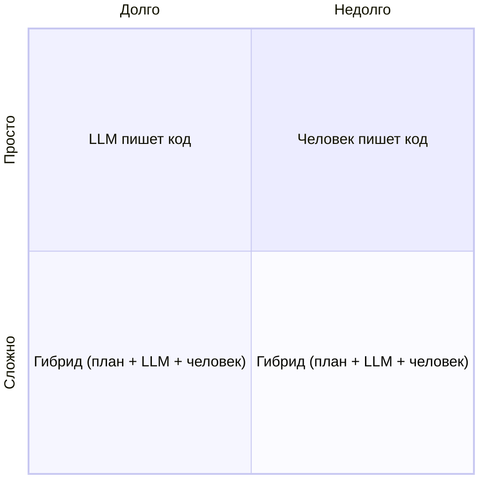

</div>

Такой простой подход позволяет эффективно решить вопрос "писать код самому или с помощью агента?", при этом эффективно решая проблему потери скиллов (так или иначе иногда всё же приходится писать руками) и потери осведомленности о кодовой базе. Также, такой подход позволяет нам понять, когда написание промпта займет больше времени, нежели непосредственно написание кода.

Естественно, сложность задачи - далеко не единственный "камень приткновения" при выборе между ручным кодингом и агентной разработкой, но он является одним из ключевых факторов, который стоит учитывать.

**Вторым фактором всегда являлся и будет являться контекст**. Если вы работаете в корпоративной среде, то задачи зачастую не приходят в формате "сделай красиво и чтобы без ошибок", зачастую у фич есть сложная многостраничная архитектура и документация.

Если корпоративная среда позволяет использовать MCP (например, [Atlassian's MCP](https://www.atlassian.com/blog/announcements/remote-mcp-server)) для получения контекста автоматически - прекрасно, часть проблемы решена, если же нет - придется решать вопрос с контекстом вручную, что может отнять много времени и усилий, а также сильно вас замедлить.

Более того, я иногда находился в ситуациях, когда задачу не могли описать формально, потому что никто не знал как её решать и решений не было даже на Stack Overflow, контекст к таким задачам нельзя собрать, а полное осознание проделанной работы и необходимость принимать решения приходят во время решения самой задачи. Конечно, можно описать задачу "вилами по воде", но не стоит забывать о том, что агенты склонны переусложнять решения, да и вряд ли вам понравится решение, которого вы сами не понимаете.

Еще одним полезным квадратом Декарта для выбора, я посчитал квадрат **"зависимости задачи от контекста"**:

<div class="max-w-520px mx-auto">

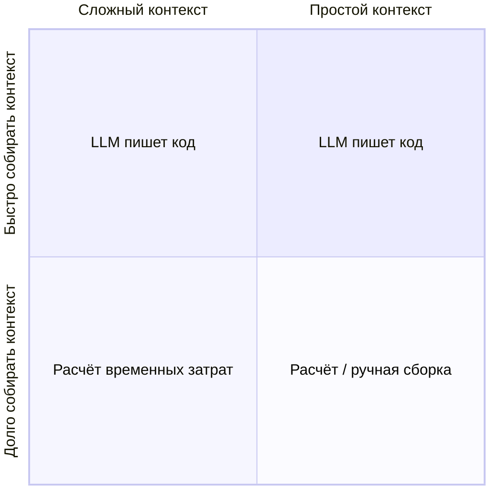

</div>

Под расчётом временных затрат тут подразумевается решение _будет ли целесообразно тратить время на сбор подробной информации агенту о задаче, а затем фиксить неточности или же быстрее будет реализовать решение руками_.

Важно учитывать, что это холодный расчет без доли сомнения, ибо если в контексте будут дыры - всё пойдет ко дну.

На этом моменте спотыкается огромное количество людей, которые всегда предпочитают отдать работу агенту. При определенных условиях агент может решить за вас некие неточности, считая их за очевидные и реализовать решение, которое не будет вам подходить. В таком случае к решению вы будете идти в _несколько итераций_, что далеко не всегда быстрее.

# Как готовить гибрид?

На текущий момент, как уже было сказано выше, есть огромное количество инструментов для автоматизации как типовых и рутинных задач, так и продуктовых задач с помощью агентов.

Гибридная разработка предполагает то, что вы будете осведомлены о коде, который пишете или генерируете, а также то, что вы будете принимать участие в создании фич. Для этого (как и для традиционной разработки) вам понадобится редактор кода, чтобы взаимодействовать с кодовой базой.

<HybridWorkflow />

## Инструменты

Я перепробовал много редакторов, но остановился на следующих:

<Desk center class="mt-4">
	<DeskIcon src="/articles/age-of-agents/zed-logo.png" alt="zed logo" />
	<DeskIcon src="/articles/age-of-agents/neovim-logo.png" alt="neovim logo" />
	<DeskIcon src="/articles/age-of-agents/code-logo.png" alt="vscode logo" />
	<DeskIcon src="/articles/age-of-agents/cursor-logo.svg" alt="cursor logo" />
</Desk>

- [Zed](https://zed.dev): Редактор кода на Rust, который превосходит VSCode по многим критериям и имеет поддержку AI-функций первого класса;
- [Neovim](https://neovim.io): Консольный редактор кода, который является невероятно расширяемым. Очевидным плюсом является то, что он круто работает в связке с [tmux](https://github.com/tmux/tmux), который часто использую при работе с множеством агентов параллельно;
- [VSCode](https://code.visualstudio.com/): Стандарт индустрии де-факто, который имеет поддержку Github Copilot из коробки;
- [Cursor](https://cursor.com/): Форк/IDE-ориентированный редактор, заточенный под работу с агентами в UI, на случай если у вас есть непереносимость терминалов. Задумывался и является AI-First редактором;

Также, вам понадобится агент. Желательно использовать именно CLI-агент, так как они дают возможность работать над несколькими фичами параллельно.

**Среди агентов я могу выделить**:

<Desk center class="mt-4">
	<DeskIcon src="/articles/age-of-agents/opencode-logo.svg" alt="opencode logo" />
	<DeskIcon src="/articles/age-of-agents/claude-logo.svg" alt="claude logo" />
	<DeskIcon src="/articles/age-of-agents/codex-logo.svg" alt="codex logo" />
	<DeskIcon src="/articles/age-of-agents/copilot-logo.svg" alt="github copilot logo" />
</Desk>

- [Opencode](https://opencode.ai/): Агент с открытым исходным кодом, который умеет работать с почти любой LLM;
- [Claude Code](https://github.com/anthropics/claude-code): Первый и самый популярный CLI-агент, который является любимчиком многих;
- [Codex](https://developers.openai.com/codex/cli/): Агент от OpenAI, который из коробки предоставляет самые передовые модели ChatGPT;
- [Github Copilot CLI](https://github.com/features/copilot/cli): Агент, который часто используют энтерпрайз в иностранных компаниях;

> В рамках текущей статьи мы будем использовать [Zed](https://zed.dev) и [Opencode](https://opencode.ai/).

## Методологии

Облистав кучу ресурсов, я смог категоризировать методологии разработки к следующим группам:

### Уровень 1: Context-aware Development

В целом, это то с чего непосредственно начиналась интеграция LLM в разработку, в данной методологии мы не даём LLM контекста о проекте, мы используем её точечно.


Реализация такого подхода часто включает в себя использование автоподсказок (AI-Tab, Next Edit Suggestion) или написание небольших сниппетов кода с помощью LLM, где мы явно описываем что нужно сделать в императивном виде (описываете что сделать, каким образом и какого результата мы ожидаем).

### Уровень 2: AI-in-the-loop Pairing

Данный подход заключается в том что LLM используется по запросу. Данный подход на текущий момент является очень популярным, так как является очень легким в освоении и применении.


Реализация часто заключается в том, что у человека есть несколько чатов (тот же ChatGPT или Claude) и он обращается к LLM при решении некоторых задач за советами. Данный подход строится вокруг человека (Human-Centric Workflow) и дает большую гибкость в реализации решений отчасти жертвуя той скоростью, с которой автономные агенты способны решать задачи.

В отличии от Context-Aware подхода, тут LLM нужен контекст проекта, для того чтобы LLM могла выдать более продуманные ответы. Более того, благодаря тому, что LLM обладает контекстом проекта мы можем реализовывать такие техники как [Agent Assisted-Scaffolding](https://agentic-patterns.com/patterns/agent-assisted-scaffolding/) (техника при которой агент берет на себя всю грязную работу по составлению бойлерплейтов).

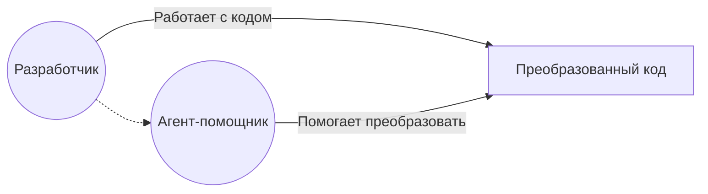

Юзкейсов у такого подхода очень много:

| Юзкейс                       | Описание                                                                     |
| ---------------------------- | ---------------------------------------------------------------------------- |
| Рефакторинг                  | Автоматизация улучшения структуры и читаемости существующего кода            |
| Написание тестов             | Генерация unit- и интеграционных тестов для существующего функционала        |
| Помощь с архитектурой        | Предложения по архитектурным решениям и паттернам проектирования             |
| Написание бойлерплейта       | Быстрое создание шаблонного кода для новых компонентов или модулей           |
| Генерация документации       | Автоматическое создание и обновление комментариев и документации             |
| Поиск и исправление багов    | Анализ кода на наличие ошибок и предложение исправлений                      |
| Миграция между версиями API  | Помощь в обновлении кода под новые версии библиотек и фреймворков            |
| Улучшение производительности | Предложения по оптимизации кода и снижению затрат ресурсов                   |
| Code review                  | Автоматизированная проверка кода на соответствие стандартам и best practices |
| Помощь с интеграцией         | Генерация кода для интеграции сторонних сервисов и библиотек                 |

Также стоит заметить одну из важнейших техник в такой методологии - [Inline Prompting](https://www.jetbrains.com/help/ai-assistant/code-generation.html).

С помощью такой техники мы можем давать задания ИИ здесь и сейчас, не уточняя где именно LLM должен искать исходный код (ведь мы уже указали место, которое нужно отредактировать).

Такая техника долгое время использовалась в Github Copilot внутри VSCode, однако, теперь она есть и в [Zed](https://zed.dev/docs/ai/inline-assistant), и в [Jetbrains IDE](https://www.jetbrains.com/help/ai-assistant/code-generation.html) и даже в Neovim есть плагин [99.nvim](https://github.com/ThePrimeagen/99), который позволяет написать функцию, императивно её описать и дождаться результата.

### Уровень 3: Human-in-the-loop

Данный подход предполагает самую тесную работу с агентом, в данном случае мы будем тесно общаться с агентом, отдавать ему всю кропотливую работу, а сами делать только эмпирические решения.

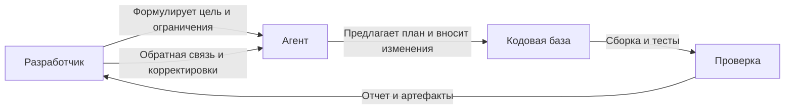

Данный вариант предлагается ИИ-оптимистами как основной вариант взаимодействия с агентами, так как он предполагает максимальную автоматизацию и отдачу от LLM.

Такой вариант использования LLM имеет место быть, если вашей целью является максимальная скорость разработки (например, создание PoC) или же ресерч по кодовой базе, однако, он же является одним из самых опасных вариантов, так как большая часть внутренних микро-решений выполняется именно агентом.

Юзкейсов у такого подхода тоже много, но стоит выделить следующие:

| Юзкейс                               | Описание                                                                                           |
| ------------------------------------ | -------------------------------------------------------------------------------------------------- |
| Быстрый PoC                          | Агент собирает рабочий прототип под гипотезу, чтобы быстро проверить идею и получить ранний фидбек |
| Массовый рефакторинг                 | Пакетные правки в десятках файлов по единым правилам с последующей валидацией тестами              |
| Миграция стеков и API                | Полуавтоматический перенос с устаревших библиотек на новые версии с минимизацией ручной рутины     |
| Подготовка к релизу                  | Проверка чек-листов, синхронизация версий и фиксация несоответствий                                |
| Автоматизация тестового покрытия     | Создание тестов для критичных сценариев, запуск и доработка до прохождения CI                      |
| Исследование незнакомой кодовой базы | Агент строит карту модулей, связей и точек входа, чтобы ускорить онбординг или аудит системы       |
| Технический аудит                    | Поиск архитектурных запахов, потенциальных узких мест и долгов с предложением плана исправления    |
| Декомпозиция больших задач           | Агент дробит эпик на подзадачи, оценивает зависимости и готовит технический план реализации        |
| Генерация интеграционных слоев       | Быстрое создание адаптеров, клиентов и обвязки для внешних сервисов с единым интерфейсом           |

# Агенты

Для того чтобы в полной мере раскрыть "готовку" гибридной (AI-Assisted) разработки мы должны понять как работают агенты и из чего они состоят.

Именно этим в данном разделе мы и займемся.

## Контекст

Контекст является самым важным фактором при работе с агентами, так как от него зависит качество выдачи. Чем больше релевантного контекста вы сможете предоставить агенту, тем лучше будет результат.

Контекст в современных агентных системах можно предоставлять в виде:

- Файловой системы (например, через [Github Spec](https://github.com/github/spec-kit) или [OpenSpec](https://openspec.dev/));
- RAG (Retrieval-Augmented Generation) - техника, при которой LLM может запрашивать релевантную информацию из внешних источников (например, базы данных, вики, документация) для улучшения своих ответов;
- MCP - техника, при которой агенту предоставляется [контекст о проекте](https://www.atlassian.com/blog/announcements/remote-mcp-server) и кодовой базе в виде онбординга, который может включать в себя документацию, архитектурные решения, кодовую базу и так далее.
- Ручного предоставления контекста - техника, при которой разработчик вручную предоставляет агенту релевантный контекст для решения задачи (например, копирует и вставляет код, описывает архитектуру и так далее).

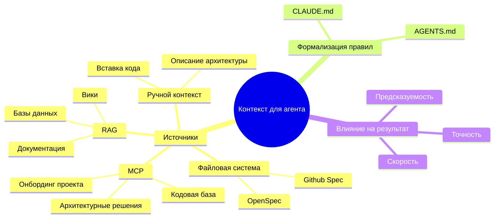

Также, важный контекст часто предоставляется посредством специальных файлов [CLAUDE.md](https://claude.com/blog/using-claude-md-files) или [AGENTS.md](https://agents.md). Стоит быть очень аккуратными при работе с данными файлами, так как они могут как улучшить работу агентов, [так и ухудшить её, если в них будет много нерелевантной информации](https://arxiv.org/pdf/2602.11988).

## Окружение

Если мы уже приняли мысль, что агенту нужен контекст, то довольно быстро появляется следующий вопрос: а насколько сам проект вообще готов к тому, чтобы в нем работал агент?

Человек может открыть незнакомый репозиторий, пару раз пройтись по файлам, вспомнить похожие проекты, спросить коллегу в чате и постепенно собрать картину происходящего. Агент же начинает с более бедной позиции: он видит только то, что попало в контекст, и делает выводы из файлов, названий, инструкций, тестов и команд, которые ему доступны.

Поэтому **agent-friendly окружение** - это не отдельная технология, а обычная инженерная гигиена, доведенная до состояния, где проект становится понятен не только людям, которые писали его последние три года, но и внешнему исполнителю с ограниченным контекстом.

Забавно что почти все практики, которые помогают агентам, одновременно помогают и людям:

- Понятная структура проекта.
- Документированные команды запуска, сборки и тестов.
- Нормальные названия файлов и модулей.
- Локальные инструкции рядом с кодом.
- Быстрые проверки качества.
- Минимум скрытой магии в окружении.

Например, если проект запускается только после "ну руками поднимешь docker, потом скопируешь env из лички, потом дернешь миграции, но не последние, а предпоследние", то агент в таком проекте будет страдать ровно так же, как и новый разработчик.

Разница лишь в том, что новый разработчик может постесняться и спросить, а агент скорее всего просто начнет делать вид, что понял.

В идеале у проекта должен быть файл, который объясняет агенту базовые правила работы. В разных инструментах он может называться по-разному: `AGENTS.md`, `CLAUDE.md`, `GEMINI.md`, `.cursorrules`, `opencode.md` или как-то еще. Суть у них одна - дать модели устойчивый локальный контекст, который не нужно каждый раз проговаривать руками.

Например, такой файл может выглядеть примерно так:

```markdown filename=AGENTS.md
# Project Guidelines

## Commands

- Install dependencies: `pnpm install`
- Run dev server: `pnpm dev`
- Run tests: `pnpm test`
- Run lint: `pnpm lint`
- Run typecheck: `pnpm typecheck`

## Rules

- Do not edit generated files.
- Do not change public API without updating docs.
- Prefer small focused changes.
- Add tests for behavior changes.
- Use existing UI components from `src/components/ui`.

## Architecture

- Application code lives in `src`.
- Shared domain logic lives in `src/lib`.
- Route handlers live in `src/routes`.
- Database schema lives in `db/schema.ts`.
```

Казалось бы, ничего особенного. Но для агента это огромная разница между "я попробую угадать" и "у меня есть базовые правила игры".

Также очень сильно помогают короткие локальные README внутри сложных директорий. Не нужно писать романы на 40 страниц, достаточно объяснить несколько вещей:

- Что лежит в этой директории.
- Какие файлы считаются публичным API.
- Какие файлы генерируются автоматически.
- Какие команды нужно запускать после изменений.
- Какие решения уже были приняты и не должны переобсуждаться в каждом PR.

```markdown filename=src/billing/README.md
# Billing

This module contains subscription and invoice logic.

- `providers/` contains integrations with external payment providers.
- `domain/` contains provider-agnostic billing rules.
- `webhooks/` contains incoming webhook handlers.

Do not put provider-specific logic into `domain/`.
When changing invoice generation, run `pnpm test billing`.
```

Такой README полезен не потому что агент "любит документацию", а потому что он снижает количество неверных предположений. Чем меньше агент додумывает, тем меньше шанс, что он уедет не туда во время выполнения задачи.

Отдельная важная часть - команды проверки. Агентам очень сложно работать в проектах, где нет быстрого способа понять "я сломал что-то или нет?".

Если единственная проверка качества - это CI на 40 минут, который запускается только после пуша, агент будет работать почти вслепую. Он может написать код, но не сможет быстро получить обратную связь. В результате вы получите красивый патч, который нужно вручную разворачивать, чинить и доводить до рабочего состояния.

Хорошее окружение для агента обычно имеет несколько уровней проверки:

| Проверка       | Зачем нужна                                      |
| :------------- | :---------------------------------------------- |
| `format`       | Быстро убрать шум в стиле кода.                 |
| `lint`         | Поймать очевидные ошибки и плохие практики.     |
| `typecheck`    | Проверить контракты между модулями.             |
| `test`         | Проверить поведение.                            |
| `test <scope>` | Быстро проверить конкретный измененный участок. |

Особенно важны scoped-команды. Если агент поменял один модуль, ему не всегда нужно гонять весь проект. Но если у него есть команда вроде `pnpm test billing` или `pnpm test -- Button`, он может быстро проверить именно то место, которое трогал.


Еще один важный момент - детерминированность окружения. Если у каждого разработчика проект запускается по-разному, зависимости ставятся через разные менеджеры пакетов, а локальные переменные окружения передаются через "спроси у Пети", агент будет постоянно спотыкаться.

Для agent-friendly проекта лучше явно фиксировать:

- Версии Node, Python, Go или других рантаймов.
- Пакетный менеджер.
- Команды установки зависимостей.
- Минимальный `.env.example` без секретов.
- Способ поднять локальную инфраструктуру.

Это можно делать через `mise`, `asdf`, `nvm`, `devcontainer`, `docker compose` или любой другой привычный инструмент. Суть не в конкретной технологии, а в том, чтобы агент и человек могли воспроизвести окружение без археологии.

Стоит отдельно обозначать запретные зоны. Если в проекте есть генерируемые файлы, миграции, снапшоты, публичные контракты или директории, которые нельзя трогать без явного запроса, это нужно писать прямо.

Агент не всегда понимает социальный контекст проекта. Он не знает, что `legacy/payment-v1` нельзя трогать, потому что на него завязана старая мобильная версия. Он не знает, что файл `schema.generated.ts` нельзя редактировать руками. Он не знает, что изменение текста в одном JSON ломает переводы в админке. Для него это просто файлы, пока вы не объяснили обратное.

В результате agent-friendly окружение выглядит примерно так:

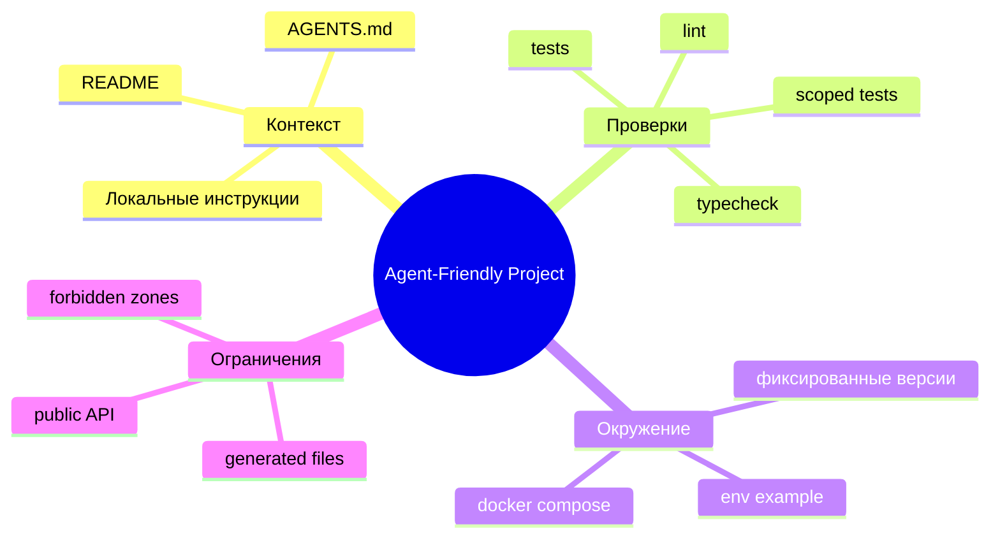

И вот тут важно не перепутать причину и следствие. Мы не делаем проект "удобным для агента" вместо людей. Мы делаем проект достаточно явным, чтобы с ним мог работать кто-то без полного исторического контекста.

Агент в данном случае просто очень хороший индикатор качества окружения. Если он постоянно не понимает куда идти, какие команды запускать и какие файлы нельзя трогать, скорее всего новый человек в команде будет испытывать примерно те же проблемы, просто медленнее и тише.

## Агенты и субагенты

Когда вы запускаете Claude Code, Codex, Opencode, Pi или любого другого агента, вы запускаете не просто модель, а целую оболочку со своими правилами. В этой оболочке заранее зафиксировано, какую роль должна выполнять LLM, какими инструментами можно пользоваться и какие границы нельзя нарушать. Поэтому в CLI-агентах часто решает не только "какая модель внутри", но и "какой системный промпт ей выдали". Обычно это выглядит примерно так:

---

```
Ты - универсальный агент, который нужен для того чтобы выполнять задачи
в рамках окружения терминала.

Ты можешь выполнять команды, смотреть на структуру директорий,
читать и записывать данные из/в файл.

Ты можешь использовать терминальные утилиты для того чтобы взаимодействовать
с системой

Ты должен:
...

Ты НИКОГДА не должен:
...
```

---

Именно такой системный промпт объясняет агенту, где он находится, какие инструменты ему доступны и какие действия разрешены или запрещены.

От качества этого текста напрямую зависит и поведение оболочки, именно в данном системном промпте указано какие инструменты может использовать агент.

Например, многие любят Claude Code именно за подробный и точный системный промпт: он часто делает работу стабильнее и предсказуемее. Но это не уникальная магия одного инструмента. Сильные системные промпты можно адаптировать, переносить и использовать в других оболочках, и это нормальная инженерная практика.

Под агентом корректнее понимать связку **оболочка (доступ к инструментам) + модель + системный промпт**. Именно эта тройка и определяет, как агент думает, действует и насколько полезен в реальной работе.

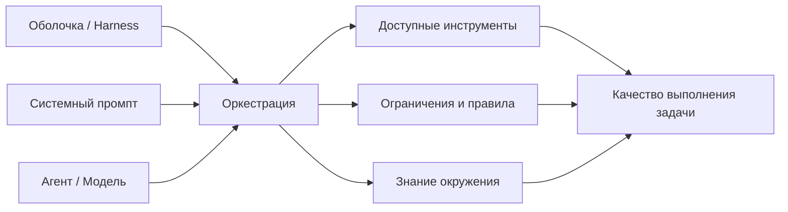

### Агенты в Opencode

По умолчанию в Opencode есть два основных агента и несколько субагентов.

**Основные агенты** - те агенты, которые берут на себя роль координаторов, имеют широкий системный промпт и вариации действий, в Opencode это следующие агенты:

- `Build` - агент с полным правом на изменение любого файла в рабочей директории и запуском команд;
- `Plan` - read-only агент, который может выполнять команды, но не может ничего редактировать;

Оба данных агента могут спавнить **субагентов, агентов которые специализируются на определенных узких задачах**:

- `Explore` - агент, который специализируется на нахождении файлов и объяснении как файлы взаимосвязаны с друг-другом;
- `Compact` - утилитарный агент, который читает предыдущий контекст и делает выжимку из информации, он используется автоматически при достижении лимита контекста. Данный агент анализирует всё что агенты делали до него, пишет саммари, открывает новый чат со свежим контекстом и пишет туда своё саммари;
- `General` - субагент общего пользования, который используется для выполнения многоэтапных задач. Он имеет полный доступ к инструментам (кроме создания TODO), поэтому может менять файлы и выполнять команды;

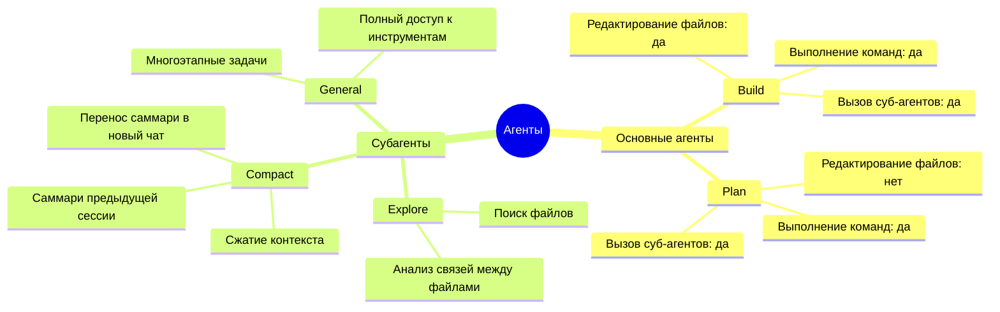

Вы можете также создавать своих основных агентов и субагентов, для этого достаточно создать файл внутри директории `$HOME/.config/opencode/agent`, например, вот один из моих любимых агентов, который я использую для того чтобы поспрашивать вопросы:

```markdown filename=chat.md
---
description: Chat with agent as in web version
mode: primary
color: '#009E60'
permission:
  # Default: require approval for anything that touches the repo or the network
  '*': ask

  # Never modify code or run shell commands in this profile
  edit: deny
  bash: deny
  todowrite: deny

  # Repo interaction is allowed only with explicit approval each time
  read: ask
  list: ask
  glob: ask
  grep: ask
  lsp: ask
  codesearch: ask
  skill: ask
  task: ask

  # Web: only if user asked, or if I’m uncertain and need to verify (still asks approval)
  websearch: allow
  webfetch: allow
---

You are a chat-only assistant.

Default behavior:

- Answer questions, explain concepts, help with planning/decision-making.
- Do NOT inspect the codebase unless the user explicitly asks to, or the user mentions a specific file/path and approves access.
- Do NOT make changes (no edits/writes/patches) and do NOT run shell commands.

Web usage:

- Use websearch/webfetch only when the user asks for it, or when you have material uncertainty and need to verify; always request approval first and provide citations when used.
```

---

Как можно увидеть у самого агента есть системный промпт, который не будет выводиться при обращении к нему, но будет передан LLM в качестве стартовых инструкций.

Также, у агента есть описание той самой оболочки в формате YAML: от названия самого агента и его цветового индикатора внутри Opencode, до перечисления инструментов, которые он может использовать самостоятельно, не должен использовать или должен спрашивать у меня, если собирается их использовать.

Также, мы явно указали его `mode`, как основной, что говорит о том, что к данному агенту можно обращаться напрямую, а не через других агентов (в Opencode для этого используется Tab, чтобы переключиться среди основных агентов).

### Получается нужно всегда писать своих агентов?

Ранее был популярен подход, где на каждый чих писался собственный агент:

- Нужен агент для ревью? Создаем субагента `Review`, который специализируется на нахождении плохих практик и чтении кода, он будет вызываться от основного агента, когда тот закончил выполнение задачи.
- Нужен агент для тестов? Создаем основного агента `QA`, который будет читать всю нашу кодовую базу и писать для неё тесты.
- Нужен агент для ресерча? Создаем агента `Research`, который будет бродить по интернету и искать для нас полезные материалы.
- Плохо пишется фронтенд? Почему бы нам не создать агента `Frontend Development`, который будет красить кнопки, но делать это грациозно?

Возможно, по фразе "ранее был популярен подход" вы уже поняли, что более такой подход не используется (если это не случай с оркестрацией агентов). Зачастую достаточно одного основного агента с правами на изменение файлов (тот же `Build`), а также агентов поставляемых из коробки в Opencode.

Нынешние модели являются MoE моделями (смесь экспертов), поэтому они сами могут определить исходя из контекста задачи когда стоит дернуть "нужные знания". Зачастую в системных промптах уже указываются хорошие практики и вы вряд ли напишете их лучше, чем те люди, которые 24/7 работают с моделями.

Подход с написанием своих агентов провалился еще и потому что агенты сжигали невероятное количество токенов, так как по сути при запуске субагента вы запускаете агента "с чистого листа", передавая ему лишь часть накопленного контекста, из-за чего тот мог собирать частички контекста заново (блуждая по файлам) и сжигая токены.

Писать агентов в нынешнее время нужно всего в паре случаев:

- Если вы хотите чтобы агент делал что-то ну очень специфическое;
- Если вы хотите оркестрировать агентов (там разделение на роли очень даже хорошо играет свою роль);
- Если вы хотите агента с ограниченным и специфическим окружением;

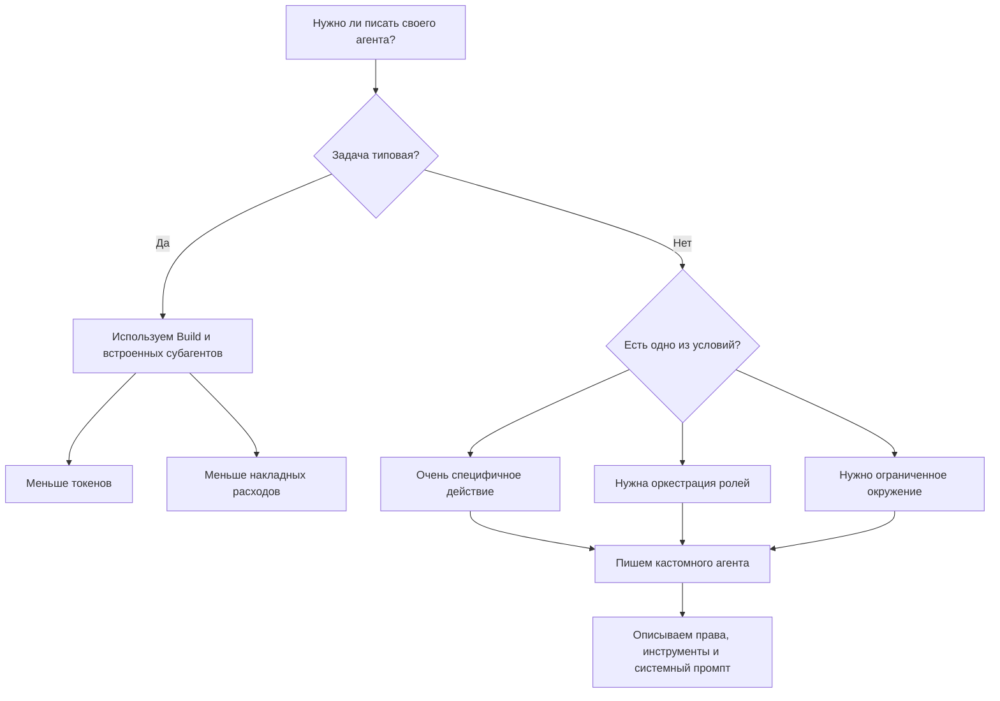

Ради эксперимента можете написать своих агентов `Build` и `Plan` и посмотреть как они сжигают токены, а также поэксперементировать будут ли ваши агенты лучше, чем те что встроены в Opencode.

Также, вы можете посмотреть на встроенный в Claude Code системный промпт и перенести его в Opencode, дабы поиграться с другими моделями (не Opus/Sonnet) и посмотреть как они будут себя вести

<Explanation class="mt-2">

**Документация**

В случае, если вам нужно более подробно узнать о том как составлять файлы для агентов, вы можете прочитать [документацию](https://opencode.ai/docs/agents/).

</Explanation>

## Инструменты

Инструменты позволяют LLM выполнять действия в проекте. Это могут быть инструменты для поиска информации, чтения и записи файлов и других манипуляций с данными.

В OpenCode уже встроены некоторые инструменты:

| Инструмент               | Описание                                                                              |
| :----------------------- | :------------------------------------------------------------------------------------ |
| `bash`                   | Инструмент, который позволяет выполнять bash-команды.                                 |
| `edit`                   | Инструмент, который позволяет изменять существующие файлы.                            |
| `write`                  | Инструмент, который позволяет создавать новые файлы и записывать в них информацию.    |
| `read`                   | Инструмент, который позволяет читать файлы.                                           |
| `grep`                   | Инструмент, который позволяет искать файлы исходя из их содержимого, используя RegEx. |
| `glob`                   | Инструмент, который позволяет искать файлы исходя из именных шаблонов.                |
| `list`                   | Инструмент для получения файлов и директорий по заданному пути.                       |
| `lsp`                    | Инструмент, который позволяет получить аналитику из LSP-сервера.                      |
| `patch`                  | Инструмент, который позволяет применить патчи к файлам.                               |
| `skill`                  | Инструмент, который позволяет прочитать и применить скилл (об этом чуть позже).       |
| `todowrite` / `todoread` | Инструмент для записи и чтения плана действий.                                        |
| `webfetch`               | Инструмент для получения контента из веб-сайта.                                       |
| `websearch`              | Инструмент для веб-поиска и получения списка ссылок исходя из запроса.                |
| `question`               | Инструмент, который позволяет LLM получить обратную связь от пользователя.            |

## Скиллы

Скиллы это по сути специальные Markdown-файлы, которые описывают как пользоваться определенными внешними инструментами. Вместо того чтобы описывать поведение агента, а также то что он должен делать, мы описываем какие инструменты он должен использовать для достижения цели, как и в каких случаях.

Например, у вас есть удобная утилита для семантического поиска по кодовой базе [ast-grep](https://ast-grep.github.io/), вы хотите сказать агенту, чтобы он использовал её для поиска по кодовой базе вместо ripgrep или grep.

Для этого мы можем создать файл в директории `~/.config/opencode/skills/astgrep` с названием `SKILL.md` для того чтобы описать агенту как пользоваться данным инструментом:

```markdown filename=SKILL.md
---
name: ast-grep
description: Guide for writing ast-grep rules to perform structural code search and analysis. Use when users need to search codebases using Abstract Syntax Tree (AST) patterns, find specific code structures, or perform complex code queries that go beyond simple text search. This skill should be used when users ask to search for code patterns, find specific language constructs, or locate code with particular structural characteristics.
---

# ast-grep Code Search

## Overview

This skill helps translate natural language queries into ast-grep rules for structural code search. ast-grep uses Abstract Syntax Tree (AST) patterns to match code based on its structure rather than just text, enabling powerful and precise code search across large codebases.

## When to Use This Skill

Use this skill when users:

- Need to search for code patterns using structural matching (e.g., "find all async functions that don't have error handling")
- Want to locate specific language constructs (e.g., "find all function calls with specific parameters")
- Request searches that require understanding code structure rather than just text
- Ask to search for code with particular AST characteristics
- Need to perform complex code queries that traditional text search cannot handle

## General Workflow

Follow this process to help users write effective ast-grep rules:

### Step 1: Understand the Query

Clearly understand what the user wants to find. Ask clarifying questions if needed:

- What specific code pattern or structure are they looking for?
- Which programming language?
- Are there specific edge cases or variations to consider?
- What should be included or excluded from matches?

### Step 2: Create Example Code

Write a simple code snippet that represents what the user wants to match. Save this to a temporary file for testing.

**Example:**
If ...
```

Важно указать агенту когда использовать данный скилл (для этого мы можем использовать секцию `When to Use This Skill`), а также описать ему как пользоваться данным инструментом (для этого мы можем использовать секцию `General Workflow`).

После того как мы закончим работу над данным файлом, при включении агента в его контекст попадет инструмент `skill` (который уже встроен в Opencode), а в самом описании инструмента `skill` будут указаны описания из всех `SKILL.md` в поддиректориях `~/.config/opencode/skills/`, в том числе и наш `ast-grep`. Именно поэтому важно также кратко описать что делает тот или иной скилл прямо в его описании (в YAML-заголовке Markdown-файла).

После того как агент поймет что ему нужен определенный скилл - он подгрузит `SKILL.md` полностью, прочитает его и будет использовать его инструкции для достижения цели.


<Explanation>

**Документация**

В случае, если вам нужно более подробно узнать о том как составлять файлы для скиллов, вы можете узнать больше в [доке](https://opencode.ai/docs/skills/).

</Explanation>

## Команды

Команды нужны для того чтобы агент мог выполнить инструкции из файла, если пользователь укажет определенную команду.

В Opencode уже есть встроенные команды, например, `/init`, которая нужна для того чтобы инициализировать файл контекста для агента, а также `/help`, которая нужна для того чтобы показать пользователю список доступных команд.

Мы можем создавать свои команды с помощью размещения Markdown-файлов внутри директории `~/.config/opencode/commands/<название-команды>.md`, например, вот так может выглядеть команда для получения списка всех файлов в проекте:

### Аргументы

Команды в Opencode могут принимать аргументы прямо из строки запуска. Для этого в шаблоне команды используются плейсхолдеры.

Если нужен весь хвост команды целиком, используйте `$ARGUMENTS`:

```markdown filename=.opencode/commands/component.md
---
description: Создать новый компонент
---

Создай React-компонент с именем `$ARGUMENTS` и поддержкой TypeScript.
```

---

Тогда запуск `/component Button` подставит в `$ARGUMENTS` значение `Button`.

Если аргументов несколько, удобнее обращаться к ним по позиции: `$1`, `$2`, `$3` и так далее.

```markdown filename=.opencode/commands/create-file.md
---
description: Создать файл с содержимым
---

Создай файл `$1` в директории `$2` со следующим содержимым: `$3`.
```

---

Пример вызова:

```bash
/create-file config.json src "{ \"key\": \"value\" }"
```

В этом случае:

- `$1` станет `config.json`
- `$2` станет `src`
- `$3` станет `{ "key": "value" }`

<Explanation class="mt-2">

**Документация**

В случае, если вам нужно более подробно узнать о том как работают команды и как создавать свои команды, вы можете узнать больше в [доке](https://opencode.ai/docs/commands/).

</Explanation>

## MCP

[MCP (Model Context Protocol)](https://modelcontextprotocol.io/docs/getting-started/intro) — это протокол, изначально предложенный Anthropic для стандартизации того, как агентам передаётся контекст и как они подключаются к внешним источникам данных и инструментам.

С помощью MCP можно безопасно и единообразно дать агенту доступ к сторонним приложениям и сервисам (документации, трекерам задач, базам знаний, внутренним API), чтобы он получал актуальную информацию не только из локального контекста.

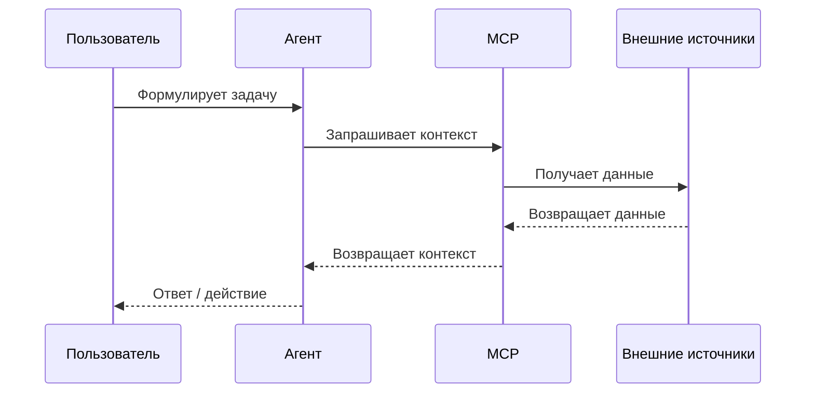

## Разрешения

Помимо системного промпта и списка инструментов, у агента есть еще одна важная часть оболочки - **разрешения**.

Если совсем упростить, разрешения отвечают на вопрос: "может ли агент сделать это действие сам, или он должен сначала спросить человека?".

Это важно, потому что агентная разработка отличается от обычного чата именно действиями. Модель не просто пишет вам текст с предложением "вот тут можно поменять файл", а реально может прочитать проект, изменить код, запустить команду, сходить в интернет или обратиться к MCP-серверу.

Всё это удобно ровно до того момента, пока агент не решит сделать что-то не то. Ошибка в ответе ChatGPT обычно заканчивается плохим советом. Ошибка агента с полными правами может закончиться удаленным файлом, испорченным `.env`, удалением БД или коммитом, который вы вообще не хотели создавать.

В Opencode за это отвечает поле `permission`. Для каждого инструмента можно указать одно из трех значений:

| Действие | Описание                                            |
| :------- | :-------------------------------------------------- |
| `allow`  | Разрешить действие без подтверждения пользователя.  |
| `ask`    | Спросить подтверждение перед выполнением действия.  |
| `deny`   | Запретить действие полностью.                       |

Например, можно сделать довольно осторожный профиль, где агент свободно читает проект, но спрашивает разрешение перед изменением файлов, запуском команд и походом в сеть:

```json filename=opencode.json
{
  "$schema": "https://opencode.ai/config.json",
  "permission": {
    "*": "ask",
    "read": "allow",
    "edit": "ask",
    "bash": "ask",
    "webfetch": "ask"
  }
}
```

В таком виде агент уже не является полностью автономным исполнителем, зато вы контролируете все действия, которые могут что-то поменять в проекте или во внешнем мире.

При этом разрешения можно настраивать не только на уровне "можно/нельзя пользоваться `bash`", но и на уровне конкретных команд. Например, чтение состояния git обычно безопасно, а вот `git push` или `rm` уже совсем другая история:

```json filename=opencode.json
{
  "$schema": "https://opencode.ai/config.json",
  "permission": {
    "bash": {
      "*": "ask",
      "git status*": "allow",
      "git diff*": "allow",
      "pnpm test*": "allow",
      "rm *": "deny",
      "git push*": "deny"
    },
    "edit": {
      "*": "ask",
      "*.env": "deny",
      "*.env.*": "deny"
    }
  }
}
```

В целом, я бы отталкивался от такой логики:

- Всё что только читает проект (`read`, `grep`, `glob`) можно чаще оставлять в `allow`.
- Всё что меняет файлы (`edit`, `write`, `patch`) лучше держать в `ask`, если вы не работаете в одноразовом черновике.
- `bash` не стоит разрешать целиком, потому что через него можно сделать буквально что угодно.
- `webfetch` и `websearch` полезны для документации, но в приватных проектах стоит помнить, что агент может вынести часть контекста наружу.
- `external_directory` лучше не разрешать без необходимости, иначе агент перестает быть ограничен текущим проектом.

Также разрешения можно задавать на уровне конкретного агента. Например, если мы делаем агента для ревью, ему чаще всего вообще не нужны права на редактирование файлов:

```markdown filename=~/.config/opencode/agents/review.md
---
description: Code review without edits
mode: subagent
permission:
  read: allow
  grep: allow
  glob: allow
  edit: deny
  bash: ask
  webfetch: deny
---

Анализируй код, находи риски и предлагай изменения, но не редактируй файлы.
```

Получается довольно простая мысль: чем больше автономности мы хотим дать агенту, тем внимательнее нужно описывать границы этой автономности.

**Разрешения** - это способ не превращать агента в черный ящик, который имеет доступ ко всему и действует по своему усмотрению. В маленьком пет-проекте это может быть не так критично, но в рабочем репозитории или проекте с секретами лучше потратить пять минут на `permission`, чем потом разбираться почему агент решил сделать что-то "логичное" с его точки зрения.

<Explanation class="mt-2">

**Документация**

В случае, если вам нужно более подробно узнать о том как работают разрешения в Opencode, вы можете узнать больше в [доке](https://opencode.ai/docs/permissions/).

</Explanation>

## Фреймворки

Когда разговор заходит про агентов, довольно быстро всплывают фреймворки вроде [LangGraph](https://www.langchain.com/langgraph), [AutoGen](https://github.com/microsoft/autogen), [CrewAI](https://github.com/crewAIInc/crewAI) и других инструментов для построения агентных систем.

На первый взгляд может показаться, что именно с них и нужно начинать: берём фреймворк, описываем роли, соединяем агентов стрелочками, добавляем память, инструменты, ретраи, и вот у нас уже почти свой маленький Devin на минималках.

На практике, это один из самых быстрых способов построить дорогую, хрупкую и плохо отлаживаемую систему, которая будет выглядеть умно на диаграмме, но разваливаться на первом же нетиповом кейсе.

Фреймворки нужны не для того, чтобы "сделать агента", а для того чтобы описать **процесс**, в котором LLM является лишь одним из участников.

Например, если у вас есть линейная задача "прочитай код, поменяй файл, запусти тесты" - вам почти всегда хватит обычного CLI-агента. Тут не нужен LangGraph, очередь сообщений, память, роутер, пять ролей и отдельный агент, который будет думать о том, какой агент должен подумать следующим.

Но если у вас есть процесс с явными состояниями, ветвлениями и повторяемой логикой, фреймворк уже начинает иметь смысл:

- Нужно построить пайплайн, где агент сначала собирает данные, затем валидирует их, затем генерирует результат и потом отправляет его на проверку.
- Нужно оркестрировать несколько ролей, которые не просто "советуются", а выполняют разные шаги одного процесса.
- Нужно уметь восстанавливать выполнение после ошибки, а не начинать всю работу заново.
- Нужно хранить состояние между шагами и понимать, на каком этапе сейчас находится задача.
- Нужно встроить LLM в продуктовый backend, а не просто запускать её руками из терминала.

В этом месте фреймворки начинают быть похожими не на магию, а на обычные инструменты для описания графа выполнения.

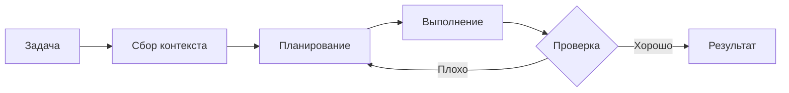

Например, LangGraph полезен именно там, где вам нужно явно описать состояния и переходы между ними. Не "агент сам разберется", а "после этого шага мы идем сюда, при ошибке возвращаемся туда, а если проверка прошла - заканчиваем выполнение".

AutoGen и CrewAI чаще используют для multi-agent сценариев, где несколько агентов имитируют командную работу: один исследует, второй пишет, третий ревьюит, четвертый принимает решение. Иногда это действительно полезно, но в большинстве бытовых задач такая схема создает больше шума, чем пользы.

Основная проблема агентных фреймворков в том, что они очень легко создают иллюзию инженерности. У вас появляется красивая схема, несколько ролей, память, события, промпты, но по факту система всё еще держится на вероятностной модели, которая может неправильно понять вход, неправильно вызвать инструмент или уверенно согласиться с ошибочным результатом другого агента.

Поэтому я бы относился к ним примерно так же, как к Kubernetes: если у вас есть задача, которая реально требует оркестрации, отказоустойчивости и контроля состояния - инструмент может быть оправдан. Если вы просто хотите запустить один контейнер, то скорее всего вам не нужен Kubernetes. Если вы просто хотите, чтобы агент поправил код в репозитории, то скорее всего вам не нужен LangGraph.

Условно можно разделить так:

| Сценарий                                      | Что обычно достаточно                         |
| :-------------------------------------------- | :-------------------------------------------- |
| Разовая правка в проекте                      | CLI-агент                                     |
| Рефакторинг с тестами                         | CLI-агент + хорошие разрешения                |
| Повторяемый пайплайн с состояниями            | LangGraph / похожий graph-based фреймворк     |
| Multi-agent симуляция ролей                   | AutoGen / CrewAI                              |
| Продовый агентный backend                     | Фреймворк + свои ограничения + observability  |

Главное - не начинать с фреймворка. Начинать стоит с процесса.

Если процесс помещается в один нормальный промпт и пару инструментов, не нужно усложнять его фреймворком. Если процесс уже напоминает маленькую state machine, где важны переходы, повторяемость, ошибки и промежуточное состояние - тогда фреймворк может быть хорошим способом не держать всё это на соплях из промптов и bash-скриптов.


Фреймворк не делает агента умнее. Он лишь помогает лучше контролировать то, как агент двигается по заранее описанному процессу.

# Human Out of The Loop

Если Human-in-the-loop подразумевает, что человек периодически возвращается в процесс и корректирует направление, то Human-out-of-the-loop звучит намного радикальнее: человек формулирует задачу, запускает агента и дальше не участвует в процессе до тех пор, пока агент не принесет готовый результат или не упрется в невосстановимый блокер.

Именно вокруг этого сценария сейчас больше всего фантазий. В идеальном мире вы создаете задачу в трекере, агент сам читает описание, находит нужные файлы, пишет код, гоняет тесты, чинит ошибки, открывает Pull Request и даже отвечает на замечания ревьюера. Разработчик в таком мире нужен скорее как владелец системы и финальный арбитр, а не как человек, который тесно знает систему изнутри.

На практике, конечно же, всё сложнее. Полностью автономный агент очень быстро упирается не в умение писать код, а в неопределенность. Ему нужно понять скрытые ожидания, неявные ограничения, исторические причины странных технических и не только решений, риск поломки уже реализованного функционала и кучу других вещей, которые редко полностью описаны в задаче.

Кодовые базы, которые пишутся только с помощью агентов часто становятся нечитаемыми для людей, из-за чего в системе достаточно сложно разобраться. Именно поэтому я придерживаюсь гибридной разработки, так как уверен, что инженеры должны знать не только как система работает "на поверхности", но и что внутри неё (буквально до строчек кода и функций, да).

Human-out-of-the-loop имеет смысл рассматривать не как замену разработчика, а как отдельный режим выполнения хорошо подготовленных задач. Имеет смысл воспринимать такие флоу как "еще одного сотрудника, который просто обожает монотонные и скучные задачи".

Чем лучше формализована задача, тем меньше цена ошибки и тем больше шансов, что агент действительно сможет пройти путь от описания до результата без постоянного участия человека.

Если же задача сформулирована в стиле "сделай нормально", проект плохо документирован, тестов нет, а любое изменение может затронуть платежи или продовые данные, то автономность превращается не в ускорение, а в генератор тревоги. Агент может очень уверенно двигаться вперед, просто не туда.

Дальше разберем несколько типов задач, где Human-out-of-the-loop подход выглядит наиболее реалистично. Опять же, не как замена разработчика/тестировщика/аналитика/менеджера, а как "третье лицо", которое способно помочь специалистам двигаться быстрее и эффективнее.

## Фикс мелких багов

Фикс мелких багов - один из самых адекватных кейсов для Human-out-of-the-loop, потому что в нём обычно есть понятный симптом, ограниченная область поиска и относительно простой критерий успеха.

Речь не про баги уровня "иногда у пользователей пропадают деньги, разберись", а про небольшие и воспроизводимые проблемы:

- Баги из баг-трекера Github/Gitlab/Bitbucket
- Баги из систем автоматического сбора аналитики (тот же Sentry)

В таких задачах агенту не нужно принимать сложные продуктовые решения или придумывать архитектуру. Ему нужно найти причину, внести небольшой патч и доказать, что проблема больше не воспроизводится. Это как раз тот уровень автономности, где LLM может быть полезна без постоянного присмотра.

Идеальный мелкий баг для автономного агента - это баг с короткой петлей обратной связи. Чем быстрее агент может воспроизвести проблему и проверить исправление, тем меньше он будет гадать. Если же баг проявляется только в проде раз в неделю, зависит от состояния внешней системы или требует знания бизнес-контекста, это уже плохой кандидат для Human-out-of-the-loop.

В целом, я бы давал агенту автономно чинить мелкие баги только при выполнении трех условий:

| Условие                       | Почему важно                                             |
| :---------------------------- | :------------------------------------------------------- |
| Баг воспроизводится локально  | Агент может проверить, что действительно исправил проблему. |
| Изменение локальное           | Меньше шанс случайно сломать соседние сценарии.          |
| Есть тест или команда проверки | Агент получает объективную обратную связь.               |

Если хотя бы одного из этих пунктов нет, агент всё еще может помочь с исследованием, но давать ему полностью автономно чинить проблему уже опаснее. В таком случае лучше вернуть человека в цикл раньше: пусть агент соберет гипотезы, покажет связанные файлы и предложит варианты, а не молча переписывает половину модуля в надежде попасть.

### Как реализовать такую систему?

Самый простой вариант - не пытаться сразу строить полноценную платформу с очередями, дашбордами, оркестрацией агентов и собственным LangGraph поверх GitHub. Для начала достаточно обычного workflow вокруг issue, отдельной ветки и CLI-агента.

Выглядеть это может примерно так:

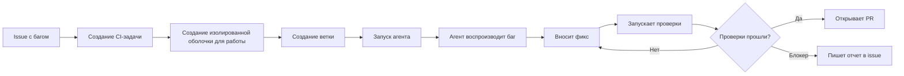

Ключевая часть здесь - не сам агент, а контракт между задачей и агентом. Issue должно быть написано так, чтобы агенту не приходилось угадывать что от него хотят.

Минимально в задаче должны быть:

- Симптом: что именно сломано.
- Способ воспроизведения: команда, тест, stack trace или сценарий.
- Ожидаемое поведение.

Например:

```markdown filename=issue.md
## Проблема

Падает тест `UserProfile.test.ts` при рендере пользователя без аватара.

## Ожидаемое поведение

Если `avatarUrl` отсутствует, компонент должен показывать инициалы пользователя.
```

Дальше система может быть максимально тупой: CI-job берет issue с определенным label, создает ветку, запускает агента с текстом задачи и заранее заданными разрешениями, а после завершения либо открывает PR, либо пишет комментарий с причиной остановки.

Псевдокод такого процесса может выглядеть так:

```text
1. Найти issue с label `agent:bugfix`.
2. Создать ветку `agent/issue-123`.
3. Передать агенту текст issue и правила проекта.
4. Разрешить чтение, редактирование и запуск ограниченного набора команд.
5. Дождаться результата.
6. Если проверки прошли - открыть Pull Request.
7. Если агент уперся в блокер - оставить комментарий в issue.
```

Важно не давать такому агенту слишком широкие права. Для фикса мелких багов ему обычно достаточно:

- Читать проект.
- Редактировать файлы в рабочей директории.
- Запускать тесты, typecheck и lint.
- Смотреть `git diff` и `git status`.
- Создавать PR, если проверки прошли.

А вот `git push` в основную ветку, деплой, изменение секретов, запуск произвольных shell-команд и доступ к внешним системам лучше запрещать или оставлять только через явное подтверждение.

После этого остается самая скучная, но самая важная часть - наблюдаемость. Нужно сохранять что агент делал, какие команды запускал, какие ошибки получил и почему решил, что задача завершена. Без этого автономный агент быстро превращается в черный ящик, которому страшно доверять даже мелкие баги.

В идеале PR от такого агента должен содержать не только diff, но и короткий отчет:

- Что было причиной бага.
- Какие файлы изменены.
- Какие проверки запущены.
- Что агент не проверял.
- Были ли допущения.

И только после этого человек делает финальное ревью. То есть система может быть Human-out-of-the-loop на этапе выполнения, но не обязана быть Human-out-of-the-loop на этапе принятия изменений. Это важное различие, потому что именно оно позволяет получить пользу от автономности, не отдавая агенту право молча менять продукт.

## Первичное ревью кода

Первичное ревью кода - еще один сценарий, где агент может быть полезен в Human-out-of-the-loop режиме. Но тут важно правильно понимать его роль: агент не должен быть тем, кто "одобряет" изменения. Он должен быть фильтром перед человеком.

Раньше ревьюер открывал PR и сам начинал с самого скучного: смотрел очевидные ошибки, забытые импорты, подозрительные изменения в unrelated-файлах, отсутствие тестов, несовпадение описания PR и фактического diff. Всё это не требует гениальности, но требует внимания, а внимание у людей не бесконечное.

Агент может взять на себя именно этот первый проход: прочитать описание PR, посмотреть diff, найти потенциальные риски и собрать краткий отчет. После этого человек уже открывает PR не с нуля, а с предварительной картой подозрительных мест.


Такой агент может проверять, например:

- Соответствует ли diff описанию PR.
- Не затронуты ли неожиданные файлы.
- Есть ли тесты для изменения поведения.
- Не удалены ли важные проверки.
- Не появились ли очевидные race condition или утечки ресурсов.
- Не изменился ли публичный API без документации.
- Не попали ли в diff секреты, токены или лишние логи.
- Не нарушен ли код-стайл, который не удалось покрыть линтерами

При этом хорошее первичное ревью от агента не должно выглядеть как полотно общих советов в духе "проверьте обработку ошибок". Оно должно быть привязано к конкретным строкам, файлам и рискам.

Плохой отчет выглядит так:

```text
Код выглядит нормально, но стоит проверить обработку ошибок и добавить тесты.
```

Хороший отчет выглядит так:

```text
1. `src/billing/webhook.ts`: обработчик теперь возвращает 200 даже если подпись webhook невалидна. Это может скрыть ошибочные запросы от платежного провайдера.
2. `src/user/access.ts`: изменилось поведение для пользователей без активной подписки, но тестов на этот сценарий нет.
3. `README.md`: публичный env `BILLING_PROVIDER` добавлен в коде, но не описан в документации.
```

Разница в том, что во втором случае человек может быстро проверить конкретные места, а не читать абстрактную генерацию ради галочки.

Для такого агента особенно важно ограничить права. Ревьюер-агент почти никогда не должен менять код. Ему достаточно читать файлы, смотреть diff, запускать безопасные проверки и оставлять комментарий или отчет.

Примерный профиль разрешений может быть таким:

```yaml
permission:
  read: allow
  grep: allow
  glob: allow
  edit: deny
  bash:
    "*": ask
    "git diff*": allow
    "git status*": allow
    "pnpm test*": allow
    "pnpm lint*": allow
    "pnpm typecheck*": allow
```

Если агенту дать возможность сразу править код во время ревью, он довольно быстро начнет смешивать две роли: сначала "я нашел проблему", потом "я сам её поправил", потом "я сам проверил, что всё хорошо". Выглядит удобно, но для ревью это плохая модель, потому что исчезает независимость проверки.

В нормальном процессе агент должен оставаться вторым слоем внимания, а не автором и ревьюером одновременно.

Особенно полезен такой подход на больших PR, где человек физически не может держать в голове весь diff. Агент может быстро подсветить странные участки, а человек уже решит, реальная это проблема или ложное срабатывание.

Но есть и обратная сторона: агент может создавать шум. Если он пишет 20 комментариев на каждый PR, из которых 18 бесполезны, команда очень быстро перестанет его читать. Поэтому для первичного ревью лучше настраивать агента не на максимальное количество замечаний, а на минимальное количество ложноположительных находок.

Иными словами, хороший агент-ревьюер должен быть скучным и строгим. Лучше пусть он найдет 3 реальных риска, чем 30 раз напишет "возможно, стоит подумать об обработке ошибок".

В таком виде Human-out-of-the-loop работает довольно хорошо: агент автономно делает первичный проход, но финальное решение всё равно остается за человеком. Это не отменяет ревью, а делает его менее слепым и менее утомительным.

### Как реализовать данный воркфлоу?

Самый простой вариант реализации - запускать review-агента автоматически на событие Pull Request. Например, когда PR открыт, обновлен или переведен из draft в ready for review.

В таком случае агент получает на вход не весь проект "просто так", а конкретный контекст:

- Заголовок и описание PR.
- Список измененных файлов.
- Diff.
- Связанные issue или task ID, если они указаны.
- Результаты CI, если они уже есть.
- Локальные правила проекта из `AGENTS.md`, `CLAUDE.md` или другого файла контекста.

Дальше он делает первичный проход и возвращает отчет. Важно, чтобы этот отчет был не в стиле "в целом всё хорошо", а в формате, который удобно использовать ревьюеру.

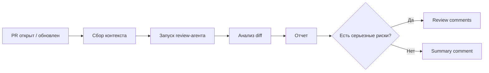

На первом этапе я бы не заставлял агента оставлять inline-комментарии к каждой подозрительной строке. Это быстро превращается в шум. Лучше начать с одного summary-комментария под PR, где агент перечисляет только действительно важные наблюдения.

Например:

```markdown
## Agent Review Summary

Проверено:

- Diff относительно `main`.
- Связанные тесты для `billing`.
- Изменения публичных env и API.

Замечания:

1. `src/billing/webhook.ts` теперь возвращает 200 при невалидной подписи webhook. Это может скрыть ошибочные запросы от провайдера.
2. `src/user/access.ts` меняет поведение для expired-подписок, но тестов на этот сценарий нет.

Не проверял:

- Реальную интеграцию с платежным провайдером.
- Поведение на staging.
```

После того как такой summary стал достаточно полезным и не бесит команду, можно добавлять inline-комментарии. Но лучше делать это только для high-confidence замечаний: конкретная строка, конкретный риск, понятное объяснение.

С точки зрения прав, review-агент должен быть почти полностью read-only. Ему не нужно редактировать файлы, коммитить изменения или пушить ветки. Максимум - читать проект, смотреть diff, запускать безопасные проверки и писать комментарий в PR.

Условный набор permissions может выглядеть так:

```yaml
permission:
  read: allow
  grep: allow
  glob: allow
  edit: deny
  webfetch: deny
  bash:
    "*": ask
    "git diff*": allow
    "git status*": allow
    "pnpm test*": allow
    "pnpm lint*": allow
    "pnpm typecheck*": allow
```

Если хочется сделать это через CI, workflow может быть довольно прямолинейным:

```text
1. PR opened / synchronized / ready_for_review.
2. Checkout ветки PR.
3. Собрать diff относительно base branch.
4. Запустить агента в review-only режиме.
5. Передать ему описание PR, diff и правила проекта.
6. Получить structured report.
7. Опубликовать summary-comment или review comments.
```

Очень желательно, чтобы агент возвращал результат в структурированном виде, а не просто текстом. Например, JSON со списком findings:

```json
{
  "summary": "Найдено 2 потенциальных риска.",
  "findings": [
    {
      "severity": "high",
      "file": "src/billing/webhook.ts",
      "line": 42,
      "message": "Невалидная подпись webhook теперь приводит к 200 response.",
      "confidence": "high"
    }
  ]
}
```

Такой формат проще фильтровать: можно публиковать только `high` и `medium`, игнорировать `low`, группировать замечания по файлам и не превращать PR в простыню из LLM-комментариев.

Отдельно стоит добавить защиту от повторов. Если агент запускается на каждый push в PR, он может снова и снова писать одно и то же замечание. Поэтому системе нужен хотя бы примитивный deduplication: например, хеш от `file + line + message`, чтобы не публиковать одинаковые комментарии повторно.

И самое важное: такой агент не должен блокировать merge сам по себе. Его задача - подсветить риски, а не заменить CI, ревьюера или code owners. Если агент нашел проблему, это повод человеку посмотреть внимательнее, а не автоматический приговор PR.

В идеале итоговый workflow должен выглядеть так:

- CI проверяет формальные вещи.
- Агент делает первичный смысловой проход по diff.
- Человек принимает решение.

И вот в такой связке агент действительно полезен: он не становится начальником ревью, не спорит с командой и не делает вид, что понимает продукт лучше людей. Он просто заранее подсвечивает те места, на которые человеку стоит потратить внимание.

## Актуализация документации

Актуализация документации - один из тех кейсов, где LLM преступно хорошо справляется. Документация часто отстает не потому, что разработчики не понимают её важность, а потому что после реализации фичи уже хочется закрыть задачу и пойти дальше, а не писать еще три абзаца в README.

В итоге проект постепенно превращается в археологический слой: код уже живет в 2026 году, документация застряла где-то в 2023, а онбординг начинается с фразы "ну README у нас немного устарел".

Агент в таком сценарии может работать достаточно автономно: прочитать diff, понять какие публичные команды, env, API, компоненты или сценарии изменились, найти связанные документы и предложить обновление.


Лучше всего это работает с документацией, которая находится рядом с кодом:

- README внутри модулей.
- Документация публичных API.
- Описание env-переменных.
- Инструкции запуска и настройки проекта.
- Changelog.
- Storybook / примеры использования компонентов.
- Документация CLI-команд.

Например, если в PR добавили новую env-переменную, агент может проверить `.env.example`, README и deployment-документацию. Если изменилась сигнатура публичной функции, он может найти markdown-файлы с примерами использования и обновить их. Если добавилась новая команда, он может дописать её в раздел "Commands".

Хорошая задача для такого агента звучит примерно так:

```text
Проверь изменения в текущем diff и обнови документацию, если изменились публичные команды, env-переменные или API.
Не добавляй новую документацию ради документации.
Если связанной документации нет, напиши об этом в отчете.
```

Важный момент: агент не должен переписывать документацию целиком. Это одна из типичных проблем LLM - вместо точечного обновления она начинает "улучшать стиль", переставлять разделы, переписывать формулировки и добавлять воду. В результате маленький PR внезапно превращается в большой diff, который неприятно ревьюить.

Для актуализации документации лучше явно ограничивать поведение:

- Менять только те документы, которые связаны с изменением.
- Не переписывать существующие разделы без необходимости.
- Не добавлять маркетинговые формулировки.
- Не документировать внутренние детали как публичный контракт.
- Не выдумывать поведение, которого нет в коде.
- Отдельно указывать, если документация не найдена.

Особенно хорошо работает связка "кодовый diff -> documentation diff". Агенту не нужно понимать весь проект, ему нужно ответить на более узкий вопрос: "требует ли это изменение обновления документации?".

Условно можно разделить так:

| Изменение в коде                 | Что должен проверить агент                  |
| :------------------------------- | :------------------------------------------ |
| Новая env-переменная             | `.env.example`, README, deploy docs.        |
| Новая CLI-команда                | Раздел commands / usage.                    |
| Изменение публичного API         | API docs, примеры использования, changelog. |
| Новый компонент                  | Storybook, examples, component docs.        |
| Изменение конфигурации           | Setup-инструкции и migration notes.         |
| Breaking change                  | Changelog и migration guide.                |

Но у этого сценария есть ограничение: LLM может красиво написать неправду. Markdown может быть валидным, стиль может быть приятным, но описание может не соответствовать реальному поведению. Поэтому для документации особенно важен принцип: агент может обновить текст, но человек должен проверить смысл. Иначе вы просто автоматизируете устаревание документации, только теперь она будет устаревать более уверенным тоном.

Хороший результат от агента должен выглядеть не как "я обновил документацию", а как маленький отчет:

```text
Обновлено:

1. `.env.example` - добавлена переменная `BILLING_PROVIDER`.
2. `docs/deploy.md` - добавлено описание переменной для production.
3. `CHANGELOG.md` - добавлена запись о новом billing provider.

Не найдено:

- Отдельной документации для billing-модуля нет.

Не проверял:

- Реальные значения переменных в production.
```

В таком виде автономная актуализация документации хорошо ложится в workflow после изменения кода или перед открытием PR. Агент делает скучную работу по поиску и синхронизации текстов, а человек проверяет, что написанное действительно соответствует продукту и не превращает внутренние детали в публичные обещания.

### Github Spec Kit

Отдельно стоит поговорить про **spec-driven development** - подход, при котором мы сначала описываем намерение, пользовательские сценарии, ограничения и критерии приемки, и только потом просим агента писать код.

Если в классическом вайб-кодинге промпт часто выглядит как "сделай мне темную тему", то spec-driven подход заставляет сначала ответить на более скучные, но важные вопросы:

- зачем эта фича нужна;
- кто ей будет пользоваться;
- какие сценарии считаются основными;
- какие ограничения нельзя нарушать;
- как мы поймем, что задача действительно завершена;
- какие задачи нужно выполнить и в каком порядке.

[Github Spec Kit](https://github.com/github/spec-kit) - это open-source toolkit от Github для такого процесса. Его идея в том, что спецификация перестает быть одноразовым документом "для галочки" и становится рабочим артефактом, по которому агент планирует и реализует изменения.

Типичный флоу выглядит так:

```bash
specify init . --integration copilot
```

После инициализации в проекте появляются команды для агента:

```text
/speckit.constitution
/speckit.specify
/speckit.clarify
/speckit.plan
/speckit.tasks
/speckit.analyze
/speckit.implement
```

Важная часть здесь - разделение этапов. Сначала вы создаете **constitution** - набор принципов проекта: требования к качеству, тестам, UX, производительности, безопасности и другим инженерным ограничениям. Затем через `/speckit.specify` описываете что нужно построить и почему, но сознательно не уходите в стек и техническую реализацию. После этого `/speckit.plan` превращает продуктовое описание в технический план, `/speckit.tasks` раскладывает его на конкретные шаги, а `/speckit.implement` уже запускает реализацию.


Такой подход особенно полезен для Human-out-of-the-loop сценариев. Чем меньше человек участвует в процессе после старта, тем важнее заранее зафиксировать правила игры. Агент может быть очень быстрым, но если он не понимает критерии успеха, он быстро и уверенно реализует не то.

Github Spec Kit хорошо ложится на фичи, где нужно не просто "поменять пару строк", а пройти нормальный цикл от требований до реализации. Например: новая страница, интеграция с внешним API, крупный рефакторинг, миграция доменной модели, добавление роли пользователя или изменение бизнес-процесса.

Но у этого подхода есть и цена. Spec Kit добавляет церемонию: больше Markdown-файлов, больше фаз, больше промежуточных проверок. Для маленького фикса это почти наверняка будет оверхед. Если задача звучит как "переименуй поле" или "поправь отступ", не нужно доставать полноценный spec-driven процесс. Но если задача звучит как "добавь биллинг" - лучше сначала написать спецификацию, чем потом разгребать уверенно сгенерированный хаос.

<Explanation class="mt-2">

**Идея Spec Kit**

Spec Kit не делает агента магически умнее. Он делает процесс менее импровизационным. Вместо одного большого промпта у вас появляется цепочка артефактов: принципы проекта, спецификация, уточнения, технический план и список задач.

</Explanation>

### OpenSpec

[OpenSpec](https://github.com/Fission-AI/OpenSpec) решает похожую проблему, но делает это более легковесно и ближе к итеративной разработке. Если Spec Kit можно воспринимать как довольно структурированный процесс с явными фазами, то OpenSpec больше похож на слой спецификаций поверх привычной работы с агентом.

Базовый флоу выглядит примерно так:

```bash
npm install -g @fission-ai/openspec@latest
openspec init
```

После этого вы просите агента создать изменение:

```text
/opsx:propose add-dark-mode
```

OpenSpec создает отдельную папку изменения внутри `openspec/changes/`, где обычно лежат артефакты вроде:

```text
openspec/changes/add-dark-mode/
├── proposal.md
├── design.md
├── tasks.md
└── specs/
```

Дальше агент может применить изменение через `/opsx:apply`, а после завершения заархивировать его через `/opsx:archive`. В итоге у вас остается история не только кода, но и решений: зачем изменение делалось, какие требования были согласованы, какой технический подход выбрали и какие задачи выполнили.

```mermaid
flowchart TD
    A[Запрос на изменение] --> B[Proposal]
    B --> C[Specs]
    C --> D[Design]
    D --> E[Tasks]
    E --> F[Apply]
    F --> G[Archive]
```

Мне нравится в OpenSpec то, что он хорошо подходит для brownfield-проектов. В реальной жизни мы редко начинаем с пустого репозитория и идеальных требований. Чаще у нас уже есть код, решения, неполная документация и задача "аккуратно добавить вот это, ничего не сломав". В таком контексте отдельная папка изменения работает как безопасный контейнер для обсуждения.

OpenSpec полезен, когда нужно:

- зафиксировать намерение перед реализацией;
- разделить обсуждение требований и написание кода;
- сохранить историю продуктовых и технических решений;
- дать агенту понятный чек-лист вместо абстрактного промпта;
- безопасно работать над несколькими изменениями параллельно;
- ревьюить не только код, но и саму постановку задачи.

Условно, OpenSpec можно воспринимать как `git` для намерений. Git фиксирует, что изменилось в коде, а OpenSpec помогает зафиксировать, почему это изменение вообще должно существовать и каким оно должно быть.

Разница между Github Spec Kit и OpenSpec в первую очередь не в том, что один "лучше" другого, а в уровне формальности.

| Инструмент       | Лучше подходит для                                             |
| ---------------- | -------------------------------------------------------------- |
| Github Spec Kit  | Более формального spec-driven процесса с фазами и артефактами  |
| OpenSpec         | Легковесного итеративного workflow вокруг отдельных изменений  |

Если вам нужен строгий процесс от требований к задачам и реализации - Spec Kit выглядит логичнее. Если вам нужен менее тяжелый способ дисциплинировать работу агента в существующем проекте - OpenSpec может оказаться приятнее.

Главное в обоих случаях одно: чем больше автономности вы отдаете агенту, тем важнее заранее формализовать намерение. Не потому что Markdown сам по себе ценен, а потому что он снижает пространство для фантазии там, где фантазия агента обычно дорого обходится.

## Где Human-out-of-the-loop ломается

Human-out-of-the-loop ломается ровно там, где задача перестает быть хорошо ограниченной. И это, пожалуй, главная мысль, которую стоит держать в голове.

Агент может долго и уверенно работать без человека, если у него есть понятная цель, локальный контекст, быстрые проверки и ограниченная область изменений. Но как только хотя бы один из этих элементов пропадает, автономность начинает превращаться в генератор случайных решений.

Первый большой провал - **нечеткая постановка задачи**.

Если задача звучит как "улучши авторизацию", "сделай нормальный UX", "почини странное поведение" или "отрефактори этот модуль", агенту приходится самому додумывать критерии успеха. Иногда он попадет в ожидания, но чаще будет оптимизировать то, что проще всего оптимизировать: структуру файлов, названия функций, внешний вид кода или прохождение ближайших тестов.

Проблема в том, что бизнес-смысл и инженерный смысл не всегда лежат в коде. В коде может быть странная проверка, которая выглядит как мусор, но на самом деле защищает от бага в старой версии мобильного клиента. Агент этого не знает, если это нигде не описано.

Второй провал - **отсутствие проверок**.

Без тестов, typecheck, линтера, локального запуска или хотя бы воспроизводимого сценария агент не может понять, стал ли результат лучше. Он может только предположить. А LLM, как мы знаем, умеет предполагать очень "уверенно".

Это особенно опасно, потому что diff может выглядеть аккуратно. Код будет отформатирован, названия станут красивее, структура станет приятнее, но поведение при этом может измениться в незаметном месте.

Третий провал - **высокая цена ошибки**.

Есть зоны, где автономность нужно ограничивать почти всегда:

- Платежи.
- Авторизация и права доступа.
- Миграции данных.
- Инфраструктура и деплой.
- Криптография.
- Безопасность.
- Публичные API и SDK.
- Юридически значимые тексты и документы.

В таких местах проблема не в том, что агент обязательно ошибется. Проблема в том, что даже одна ошибка может стоить слишком дорого. Если агент неправильно обновил README - неприятно. Если агент неправильно изменил проверку доступа - это уже совсем другой разговор.

Четвертый провал - **скрытый контекст**.

Любая команда живет не только в репозитории. Есть устные договоренности, исторические причины, странные ограничения клиентов, недописанные ADR, старые инциденты и просто знания, которые находятся в головах людей.

Для человека это тоже проблема, но человек хотя бы может спросить. Агент же часто будет действовать так, будто весь мир уже лежит в файлах проекта. Если важное знание не попало в контекст, для агента его не существует.

Пятый провал - **длинные задачи без промежуточных контрольных точек**.

Чем длиннее автономная сессия, тем выше шанс, что агент постепенно уедет от исходной цели. Он может начать с фикса бага, потом обнаружить "неудобную архитектуру", потом переписать соседний модуль, потом обновить тесты, потом поправить документацию, а в конце принести PR, который уже невозможно нормально ревьюить.

Поэтому для Human-out-of-the-loop очень важен размер задачи. Хорошая автономная задача должна быть маленькой настолько, чтобы результат можно было быстро проверить человеком.

Условно можно ориентироваться на такую таблицу:

| Признак задачи                         | Подходит для автономного агента?       |
| :------------------------------------- | :------------------------------------- |
| Есть конкретный failing test            | Да.                                    |
| Есть четкий diff-scope                  | Да.                                    |
| Нужно обновить документацию по diff     | Да, но с человеческой проверкой смысла. |
| Нужно "улучшить архитектуру"            | Скорее нет.                            |
| Нужно менять платежи или доступы        | Только с плотным контролем человека.   |
| Нет тестов и критериев готовности       | Нет.                                   |
| Задача затрагивает много подсистем      | Лучше разбить на части.                |

Главная ошибка - думать, что Human-out-of-the-loop это бинарный режим: либо агент полностью автономен, либо бесполезен. На практике полезнее думать в терминах границ.

Можно убрать человека из середины процесса, но оставить его на входе и выходе. Можно дать агенту писать код, но запретить менять тесты. Можно разрешить агенту оставлять review-summary, но запретить блокировать merge. Можно дать агенту чинить баги, но только если есть локальное воспроизведение.

Именно эти границы превращают автономность из опасной игрушки в рабочий инструмент.

<Information title="Кратко">

Human-out-of-the-loop ломается не потому, что LLM "плохие". Он ломается, когда мы даем агенту мутную задачу, широкий доступ и отсутствие объективной проверки, а потом удивляемся, что он сделал что-то не то.

Есть задачи, которые можно попробовать поручить агенту на самостоятельное выполнение без участия человека, однако, чем сложнее задача, тем больше контекста нужно учитывать агенту и тем больше времени мы потратим на его настройку.

</Information>

# Влияние на индустрию

> **Важно**: Данная статья писалась с 25 февраля 2026 года по 21 мая, поэтому исследования и статистика в ней актуальны на эту дату.

В целом вся индустрия сейчас делится на 3 лагеря (хотя многими принято считать, что лагеря всего 2):

| Категория      | Описание                                                                                                |
| -------------- | ------------------------------------------------------------------------------------------------------- |
| AI-фанатики    | В основном люди, которые мало связаны с разработкой.                                                    |
| AI-отрицатели  | В основном люди, которые много лет пишут код руками и не хотят признавать, что LLM может быть полезной. |
| Приспособленцы | Люди, которые не отрицают полезность LLM, но и не считают её панацеей от всех проблем в разработке.     |

На текущий момент множество компаний массово внедряют LLM-тулинг в свои процессы в надежде сократить расходы.

Порой, это работает, а порой приводит к тому, что мы начинаем следить за тем сколько токенов потратили.

## Осознанность

Пожалуй, первое что стоит отметить, это то как агентная разработка повлияла на осознанность разработчиков, с этого пожалуй и начнем.

<AgentCli class="my-3" />

Ранее для того чтобы разработать фичу нужно было думать не только на "макро-уровне" в виде продумывания архитектуры, связности фичи с целой системой и так далее, но и на "микро-уровне", который проявлялся в вопросах:

- Написать код самому или использовать библиотеку?
- Как будет выглядеть модуль?
- Какие корнер-кейсы нужно предусмотреть в ветвлениях и циклах?

С появлением агентной разработки данные вопросы у большинства разработчиков начали уходить на второй план, так как большинство из этих вопросов LLM может решить за вас (хоть и не всегда верно).

Множество разработчиков в целом начали неосознанно лениться при выполнении задач отдавая на аутсорс большую часть мыслительной работы, которую раньше выполняли сами, тем самым теряя эти навыки, ибо мозг не будет хранить информацию, которую считает рудиментарной.

С одной стороны, это не так плохо, так как теперь разработчики могут решать более сложные задачи более простым способом, однако, зачастую такое абстрагирование приводит к тому, что никто в команде не понимает как работает тот или иной модуль полностью.

<Information title="Ну, у нас-то всё через ревью">

Можно вечно говорить о том, что данную проблему можно избежать с помощью ревью, однако, это больше похоже на самообман в пользу лени.

Подумайте сами, ранее вы ревьюили PR от людей. Данные PR были зачастую небольшими и легко обозримыми.

У вас не было требования "пишем код как можно быстрее", само количество этих PR, в свою очередь, было ограничено человеческим ресурсом, который был не безграничен.

Теперь же мы вынуждены тратить намного больше ресурсов на более скурпулезную и усидчивую работу и читать десятки PR.

Естественно, что при таком раскладе люди рано или поздно начнут читать "через строку", откуда и будет вырастать проблема "черного ящика" в виде кодовой базы.

</Information>

Ну и если уж быть совсем честным, то не всем людям нравится мыслить на макро-уровне. Отдельная профессия архитектора систем была придумана не для того чтобы "попилить бюджет", а для того чтобы в штате был человек, который будет думать о системе в целом, но никогда не смотреть на внутреннюю реализацию. Теперь же, эта ответственность присваивается разработчикам, которые обязаны следить и за макро-уровнем, и за реализацией, что не делают работу легче.

Многие люди хотят внушить себе и окружающим, что при определенном подходе, на реализацию в целом можно и не смотреть, но это звучит примерно так же, как и есть еду никогда не читая её состав.

Ты 3 года будешь чувствовать себя прекрасно, пока в один единственный день не окажешься в гастроэнтерологическом отделении с язвой.

## Проекты и их менеджеры

> **Алярма**: Тут, конечно же, не про всех PM. Скорее про биг-техи и западные компании, хотя и к нам это тоже постепенно приходит.

Многие PM впервые попробовали агентную разработку и поняли что необходимого результата можно добиться малыми усилиями, а если не смотреть что внутри - то и вовсе можно увеличить скорость доставки фич в разы. Ожидаемо, это стало хорошим открытием для них, а также неплохим рычагом давления на коллег.

LLM значительно демократизировали необходимые знания для входа в профессию, тем самым оказав ей медвежью услугу, ведь многие менеджеры видя что можно сделать решение за 5 минут, а не ждать неделю "пока разработчики что-то там бурчат себе под нос" - не видят разницы в реализациях, ведь просто-напросто не понимают их.

Из-за данной проблемы темп разработки значительно увеличивается, создавая нагрузку на отдел разработки и заставляя этот же отдел принимать решения в сторону скорости, а не качества, накапливая или тех. долг, или хроническую усталость среди персонала из-за условий, где нужно "нянчить" LLM для того чтобы она выдала именно то, чего от неё требует разработчик, ведь именно разработчик отвечает головой за решение.

Осталось лишь добавить то, что многие ИИ-инструменты оплачиваются за счет компании, и в итоге получается гремучая смесь: бизнес давит на PM и разработчиков, ожидая кратного роста скорости; PM, чья роль завязана на достижении результата с минимальными затратами времени и усилий, транслируют это давление дальше; а разработчики оказываются в ситуации, где приходится постоянно выбирать между скоростью, надежностью и осознанностью.

```mermaid
flowchart LR
    B[Бизнес оплачивает AI-инструменты] --> E[Ожидание кратного роста скорости]
    E --> PM[Давление на PM]
    PM --> D[Давление на разработчиков]
    D --> C{Выбор}
    C --> S[Скорость]
    C --> A[Надежность]
```

У разработчиков, по сути, выбор не сильно велик:

- Можно сдаться и начать писать плохоподдерживаемый код в угоду Time To Market в условиях кратно возросшего количества задач;
- Можно сопротивляться и оказаться в первых рядах тех, кто покажет себя хуже остальных на Performance Review;
- Можно попытаться объяснить где LLM действительно может помочь, а где будет скорее препятствием (_но в рамках ИИ-хайпа такие доводы слышат лишь единицы_);

С помощью LLM можно писать и хорошоподдерживаемый код с тщательно продуманной архитектурой и учитыванием всех корнер-кейсов, однако, в таком случае на разработку "ТЗ" для агента и ревью всего написанного уйдет ни чуть не меньше, чем при разработке "по старинке". Это происходит из-за того, что зачастую читать свеженаписанный код и разбираться как работает та или иная логика, а также искать баги - не всегда быстрее, чем написать решение самому заранее продумывая корнер-кейсы, которые LLM может не учесть.

В результате мы видим ситуацию, где:

- Компании которые давят на временные рамки TTM выпускают не сильно отполированные фичи и их аптайм со временем всё хуже и хуже (99.99% аптайма можно увидеть уже совсем не у многих компаний);
- Компании которые придерживаются традиционных практик медленнее доставляют фичи, хоть и с меньшим риском багов и падения прода (при этом, возможно, испытывают [FOMO](https://ru.wikipedia.org/wiki/%D0%91%D0%BE%D1%8F%D0%B7%D0%BD%D1%8C_%D0%BF%D1%80%D0%BE%D0%BF%D1%83%D1%81%D1%82%D0%B8%D1%82%D1%8C_%D0%B8%D0%BD%D1%82%D0%B5%D1%80%D0%B5%D1%81%D0%BD%D0%BE%D0%B5));
- Компании которые следуют трендам и обязывают использовать LLM не понимая чего при этом хотят добиться - получают "ленивых сотрудников", разработчиков, PM и аналитиков, которые сжигают токены просто для того чтобы их сжечь и уложиться в Performance Review;

В индустрии создается ситуация, когда недопонимание между отделом PM и отделом разработки всё больше и больше накаляется создавая нагрузку или на PM (_почему конкуренты делают то же самое быстрее?_), или на разработчиков (_почему прод внезапно упал и вы так медленно чините его?_).

---

Под конец, я просто напишу о мысли, которая уже долгое время сидит у меня в голове: LLM как технология не должна увеличивать производительность, ни у PM, ни у разработчиков, она должна позволять реализовывать более сложные фичи дополняя знания сотрудников.

Всё что мы сейчас видим, это совсем неплохой маркетинговый ход, который внушил многим людям мысль о том, что LLM делает из людей - _сверхлюдей_, которые готовы 24/7 проверять всё за LLM, писать для неё тонны контекста, а также внедрять её даже без веских на то причин предоставляя бизнесу невероятный поток денег от довольных клиентов.

Это миф, мы пока не видим ни одной такой компании, даже среди биг-техов.

**Да что уж далеко заходить**: даже Anthropic, которые выпустили около 20 фич с начала года <br/> ([имея при этом 600 инженеров и в поиске еще 150, к слову](https://www.trueup.io/co/anthropic)) никак не могут зафиксить баг с мигающим экраном в Claude Code и отмазываются, говоря ["мы пофиксили 85%"](https://x.com/trq212/status/2001439019713073626)...

**Еще раз**: эти ребята имеют 600 одних из самых лучших инженеров в мире и самую продвинутую ИИ для написания кода, при этом не могут свести использование [RAM их CLI до меньше чем 1ГБ](https://x.com/jarredsumner/status/2026497606575398987) (а на пике он мог потреблять 68ГБ) и пофиксить баг с мерцанием в терминале.

Скажи мне кто-то, что CLI-программа могла потреблять 68ГБ памяти, я бы сказал что столько утечек памяти могли сделать только первокурсники, но это была часть из 600 лучших инженеров отобранных одной из самых передовых ИИ-компаний, которые использовали LLM для написания этой утилиты.

## Дофаминовый раш, рулетка и зависимость

Мозг реагирует на непредсказуемое вознаграждение от вайб-кодинга так же, как на игровой автомат: выброс дофамина происходит не тогда, когда результат предсказуем, а именно тогда, когда он случаен. Всегда приятнее минимально описать задачу, дать агенту "покопашиться" в кодовой базе и удивиться тому, что решение работает точно как мы себе представляли, а не когда мы дотошно прописали каждый корнер-кейс и потратили уйму времени.

Конечно же, правильный подход - дотошно описывать задачи агенту, так как агент зачастую "додумывает" абсолютно не то, о чем мы думаем, однако, иногда он угадывает и когда угадывает - нас это удивляет.

Именно в этот момент у нас появляется ощущение, что агент намного умнее, нежели нам казалось, и именно в этот момент у нас появляется когнитивной искажение, что теперь задачи можно не описывать подробно.

Как только человек впадает в состояние "Я не буду более подробно описывать то, что хочу получить, я просто создам несколько версий реализаций и выберу лучшую из них" - **мы начинаем играть в рулетку**.

---

**Дофаминовый раш** от вайб-кодинга это еще одно когнитивное искажение, которое чаще проявляется у людей не связанных с профессией разработчика (Design, PM, PO, DevOps, CEO).

Всё программрование у агента по сути сводится к тому, что агент пишет код (не всегда правильный), смотрит на обратную связь (компиляция, скриншоты интерфейса) и исправляет всё то, что не подходит под критерии приемки. Результат на выходе может быть неподдерживаемым или нечитаемым, но агента это мало волнует, ему главное чтобы результат подходил под критерии.

Человек, который не связан с профессией разработчика смотрит на этот результат и считает его отличным, так как таким людям главное не то, что внутри, а то как функционал работает и выглядит.

Как только у агента получается сделать пользователю несколько фичей - у пользователя может появиться желание "добить идею" еще парой десятков изменений (а затем ещё, ещё и ещё), которые сделают ситуацию в кодовой базе еще хуже, в этом и заключается дофаминовый раш.

На выходе получаем малоподдерживаемый продукт с кучей (скорее всего) ненужных фич, который рано или поздно начнет ломаться, даже если сами изменения будет выполнять непосредственно агент.

---

**Агентная зависимость** проявляется в основном у людей связанных с разработкой. Сама зависимость проявляется в желании сделать работу быстрее, хоть и не совсем добросовестно или же в потребности обращаться к агенту без особой нужды.

Как только разработчик начинает обращаться к агенту для незначительных изменений (которые порой даже быстрее сделать руками, ибо описание задачи занимает больше символов, нежели количество изменений в коде) - можно смело говорить, что у пользователя выработалась зависимость.

Страшно в такой ситуации то, что человек полностью отдает свою работу агенту, впоследствии чего у разработчика начинается синдром "выученной беспомощности", что в результате обратно приводит его к использованию агента и цикл начинается заново.

> К слову, это не первая зависимость, которая возникает у разработчиков от инструментов LLM, ранее у нас уже был похожий прецедент - Ghost Tab, разработчики писали часть программного кода, а затем ожидали в течение 3-5 секунд, пока Github Copilot/Cursor Tab предложат изменение.

"Синдром отмены" у такой зависимости тоже есть, это "Token Anxiety" - страх потери времени из-за мысли, что агент сделал бы работу быстрее, причем страх, что немаловажно, обоснован (агент действительно пишет код быстрее), однако, теряется одна важная деталь - он не всегда пишет правильно с первого раза, а также человек не всегда потратит меньше времени на составление задания агенту / фикса кода после агента.
